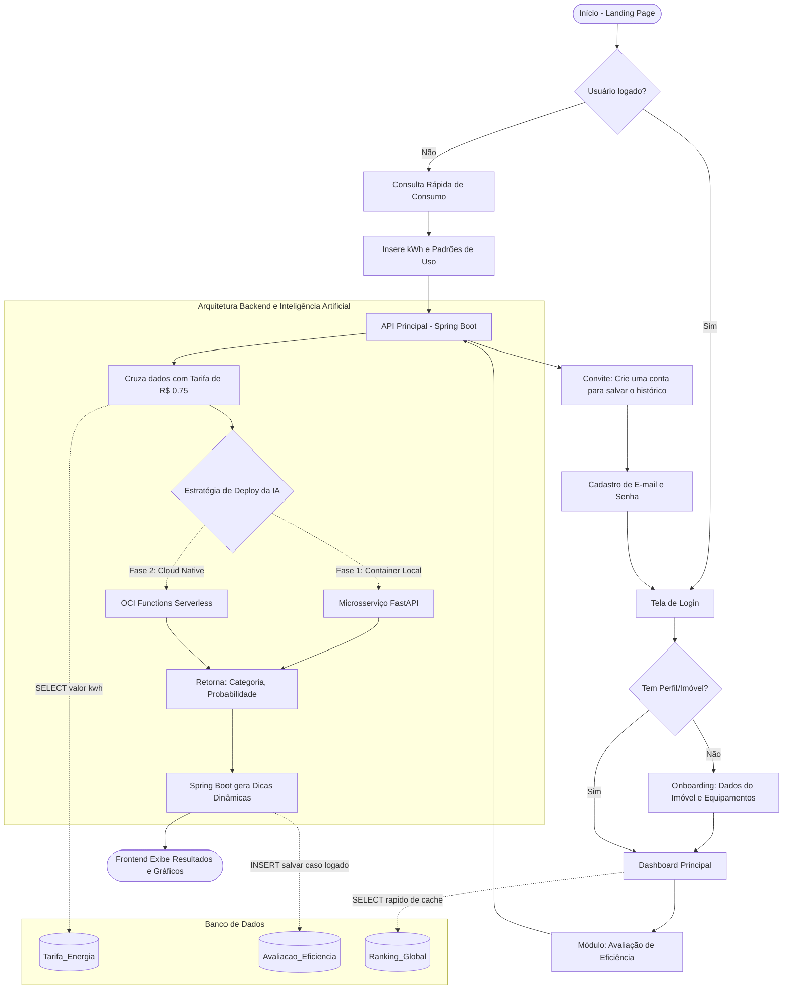
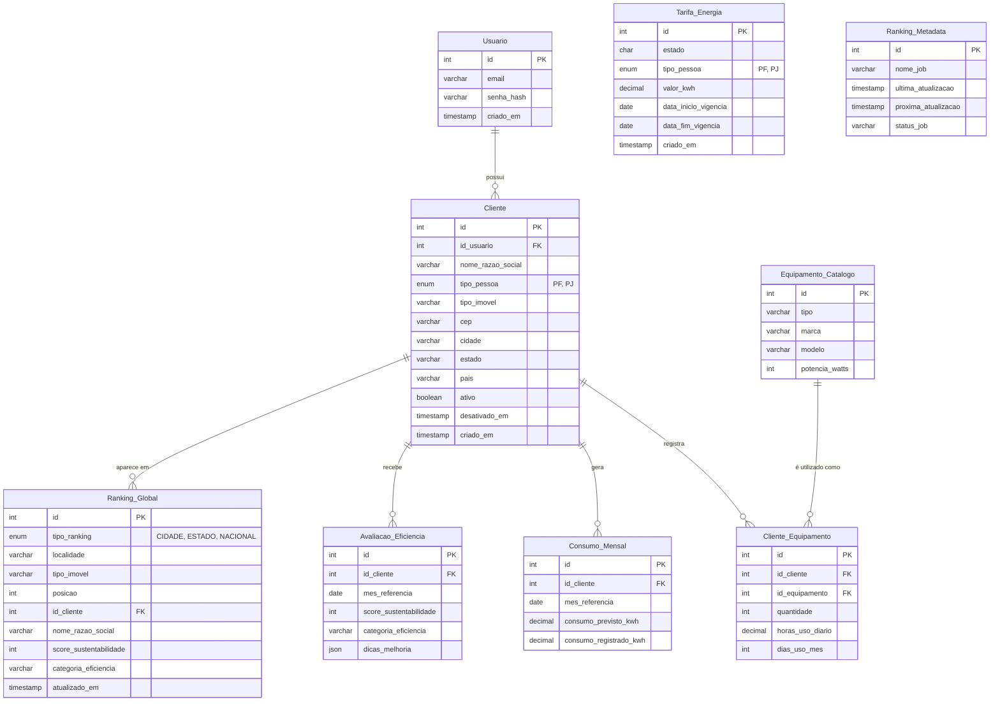

## Introdução

A crescente demanda por eficiência energética e a necessidade de otimização de custos operacionais representam desafios significativos tanto para residências quanto para o setor corporativo, em especial para microempreendedores individuais (MEI) e pequenos negócios. Nesse cenário, o monitoramento tradicional do consumo elétrico frequentemente se mostra reativo, limitando a capacidade dos consumidores de antecipar gastos e adotar práticas sustentáveis.

Para suprir essa lacuna, a LUMEN surge como uma solução inteligente e integrada, capaz de analisar detalhadamente padrões de consumo de energia elétrica a partir do inventário de equipamentos e de métricas de uso. Desenvolvida para atuar como uma ferramenta de apoio à tomada de decisões, o sistema combina uma arquitetura de microsserviços em Java (Spring Boot) com modelos preditivos de Inteligência Artificial e Machine Learning em Python (FastAPI).

A plataforma automatiza processos complexos de auditoria energética ao calcular o score de sustentabilidade, atribuir categorias de eficiência e fornecer diagnósticos personalizados por meio de dicas de melhoria. Além disso, visando engajar os usuários e promover a conscientização ambiental, o sistema implementa um módulo de Ranking de Sustentabilidade gamificado e segmentado por escopo geográfico (País, Estado, Cidade). Dessa forma, a LUMEN une rigor técnico, predição baseada em dados e gamificação para transformar dados brutos de energia em informações acionáveis para a eficiência energética.

## Índice  
- [Introdução](#introdução)
- [Índice  ](#índice)
- [Diagrama de Fluxo](#diagrama-de-fluxo)
- [Diagrama Entidade Relacionamento (v1.0)](#diagrama-entidade-relacionamento-v10)
- [LUMEN API](#lumen-api)
  - [Padrão Arquitetural e Comunicação](#padrão-arquitetural-e-comunicação)
  - [Segurança e Controle de Acesso](#segurança-e-controle-de-acesso)
  - [Principais Módulos Expostos pela API](#principais-módulos-expostos-pela-api)
  - [Documentação Interativa (OpenAPI / Swagger)](#documentação-interativa-openapi--swagger)
- [ML-Service](#ml-service)
  - [Modelo Principal: Random Forest](#modelo-principal-random-forest)
    - [Modelo MVP: Árvore de Decisão](#modelo-mvp-árvore-de-decisão)

## Diagrama de Fluxo

## Diagrama Entidade Relacionamento (v1.0)

## LUMEN API
A camada de interface do sistema LUMEN é estruturada por meio de uma API RESTful robusta e escalável, desenvolvida em Java utilizando o ecossistema Spring Boot. A aplicação adota o padrão arquitetural em camadas — separando responsabilidades entre controladores (Controllers), regras de negócio (Services), persistência (Repositories) e transferência de dados (DTOs) —, o que assegura alta testabilidade, facilidade de manutenção e desacoplamento de componentes. Alem de seguir os princípios do DDD.

### Padrão Arquitetural e Comunicação
A API atua como o núcleo orquestrador do sistema, expondo endpoints padronizados em formato JSON e integrando-se de forma assíncrona ou síncrona com o microsserviço de Inteligência Artificial (ml-service em Python/FastAPI). A comunicação segue rigorosamente as convenções do protocolo HTTP, utilizando os verbos apropriados (GET, POST, PUT, DELETE) e códigos de status padronizados para o retorno de sucesso ou tratamento de exceções.

### Segurança e Controle de Acesso
Para garantir a integridade dos dados e a privacidade dos usuários, a API implementa uma camada de segurança stateful/stateless baseada no Spring Security combinada com autenticação via JSON Web Token (JWT).

O fluxo exige que o usuário realize a autenticação prévia para obtenção de um token criptografado.

As requisições subsequentes para recursos protegidos devem incluir o token no cabeçalho de autorização (Authorization: Bearer <token>).

Rotas públicas essenciais — como a documentação da API e consultas abertas do ranking de sustentabilidade — são devidamente liberadas nas configurações de filtro, preservando a segurança corporativa sem comprometer a usabilidade.

### Principais Módulos Expostos pela API
A interface de programação está organizada por domínios funcionais bem definidos:

- Módulo de Autenticação e Usuários: Gerencia o cadastro de credenciais, login e a emissão de tokens de acesso.

- Módulo de Clientes e Imóveis: Permite o registro de perfis (Pessoa Física e Jurídica) e a especificação do tipo do imóvel e sua localização.

- Módulo de Equipamentos: Controla o catálogo técnico de eletrodomésticos e o vínculo de consumo por cliente (potencia, horas de uso diário e frequência mensal).

- Módulo de Avaliação Energética: Expõe rotas para submissão de dados ao motor de IA, cálculo do score de sustentabilidade e recuperação de diagnósticos e dicas de melhoria.

- Módulo de Ranking Global: Disponibiliza endpoints para a listagem pública do Top 10 e consulta individual de posições, segmentados por escopo geográfico e atualizados de forma automatizada.

### Documentação Interativa (OpenAPI / Swagger)
Em conformidade com as melhores práticas de desenvolvimento de software, a API conta com documentação automática e interativa integrada por meio da especificação OpenAPI 3 (SpringDoc).

A interface visual do Swagger UI pode ser acessada diretamente em ambiente de desenvolvimento através da rota:
http://localhost:8080/swagger-ui.html

Essa ferramenta permite visualizar todos os contratos de entrada e saída, verificar os DTOs esperados e testar os endpoints diretamente pelo navegador, contando inclusive com suporte integrado para injeção de tokens JWT no botão de autorização (Authorize).

## ML-Service

### Modelo Principal: Random Forest

68,5% de acurácia, F1 macro 0,676 (comparado com Regressão Logística 66,5% e Árvore de Decisão 57,5%, todos testados com o mesmo pré-processamento, incluindo normalização das variáveis numéricas pra garantir comparação justa entre os modelos).

#### Modelo MVP: Árvore de Decisão

99% de acurácia (comparado com Random Forest 98,5% e Regressão Logística 92%, todos testados com o mesmo pré-processamento, incluindo normalização das variáveis numéricas pra garantir comparação justa entre os modelos).

